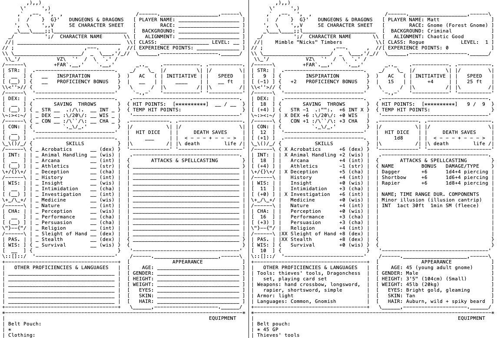

ASCII Dungons and Dragons Character Sheet
=========================================

The first time I played D&D and was faced with the task of tracking character
information on a character sheet, all I could think was, 'this needs to
happen in plain text'.

I saw potential advantages of tracking the character development and
campaign notes with version control, and enjoying retro ASCII-art in the
process, all from the mild comfort of my favourite text editor.
The alternative seemed to be to track character information in a
form-fillable PDF (for an awful user experience) or on paper (probably
also ideal, but alas, I lacked a printer for the template).

To my surprise, a quick search turned up no ASCII-based character sheet
templates. So, I tried my hand at making one based on the standard PDF.
This repository contains the [ASCII template](character-sheet.txt) that is
the result of my attempt, and an [example](example-rogue.txt) populated up
to the end of my first-ever D&D session.

Preview
-------

Disclaimer
----------

I **don't** really use this character sheet. Of course, it's a little painful
to manually maintain the text alignment.

These days, there are better alternatives to form-fillable PDFs (my friends
like D&D Beyond, though I'm not a big fan; I use handwritten notes on a
custom template on my reMarkable e-paper tablet, which even has its
advantages over paper).

Besides, this was made before I had played much so it's probably missing some
important features.

Anyway, someone might find this cool/useful.

Testimonials
------------

> you have a problem matt, you need to seek help
> ---a true friend

> wow the memories
> ---Rayvwen (yes, the e-celeb)

Credits
-------

Some of the ASCII art is not originally my own. Signatures are included where
possible. More examples with signatures are in [scratch.txt](scratch.txt).
Unfortunately, links to the original sources are lost.

Otherwise, made with :purple_heart: by Matt.
